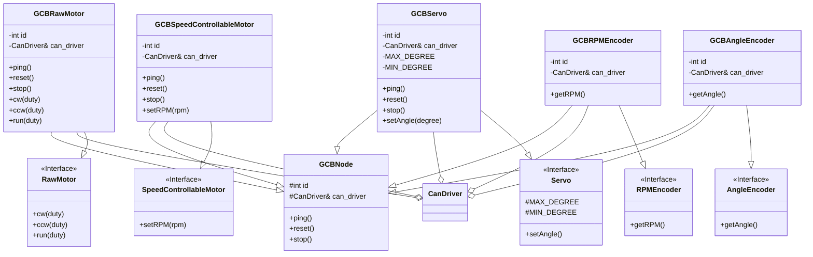

# Class Design

## Diagram

## Explain

### GCBNode

汎用基板を用いたクラスの基底クラス。idとCanDriverへの参照を持つ。

### GCBRawMotor

汎用基板を用いモータをDuty比で制御するクラス。

### GCBSpeedControllabelMotor

汎用基板を用いモータを速度制御するクラス。

### GCBServo

汎用基板を用いモータを角度制御するクラス。

### GCBRPMEncoder

汎用基板から回転速度(rpm)を取得するクラス。

### GCBAngleEncoder

汎用基板から角度を取得するクラス。
