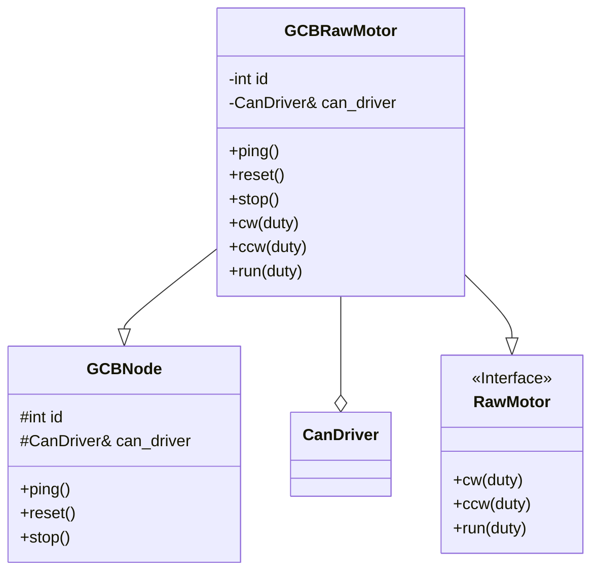
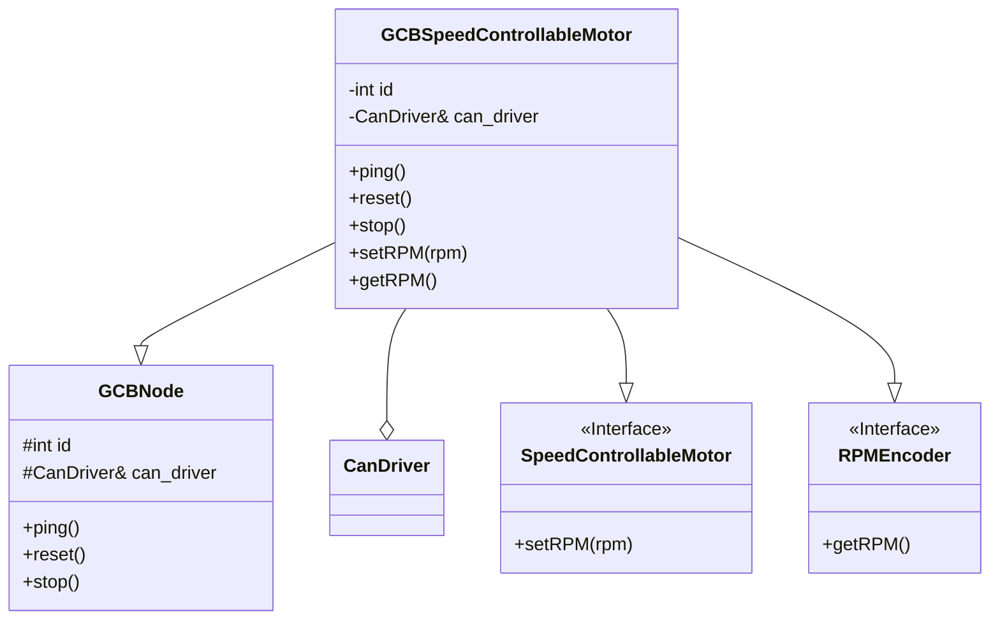
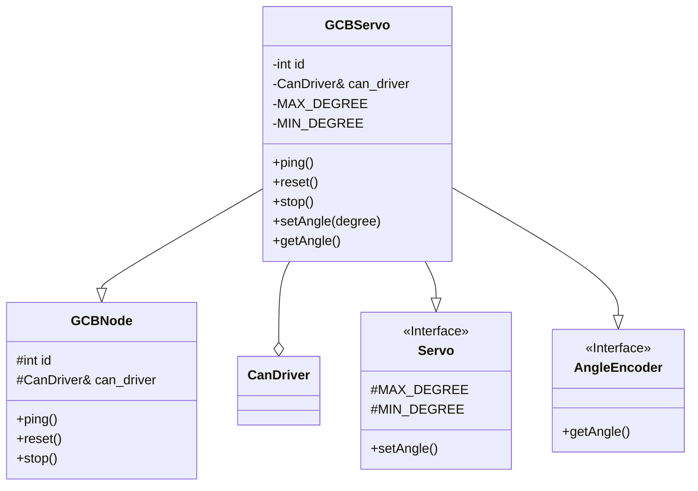
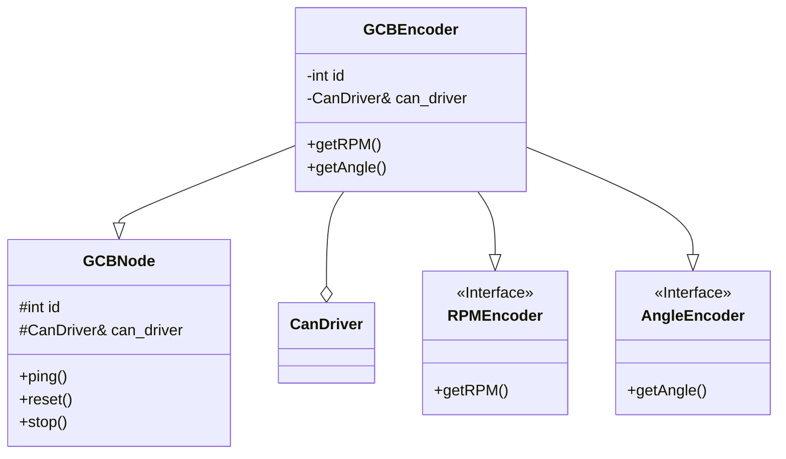

# Class Design

## Diagram

## Explain

### GCBNode

汎用基板を用いたクラスの基底クラス。idとCanDriverへの参照を持つ。

### GCBRawMotor

汎用基板を用いモータをDuty比で制御するクラス。

### GCBSpeedControllabelMotor

汎用基板を用いモータを速度制御するクラス。

回転速度を取得可能。

### GCBServo

汎用基板を用いモータを角度制御するクラス。

角度を取得可能。

### GCBEncoder

汎用基板から回転速度(rpm)及び角度を取得するクラス。
