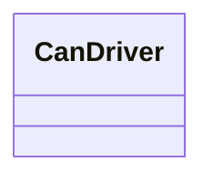
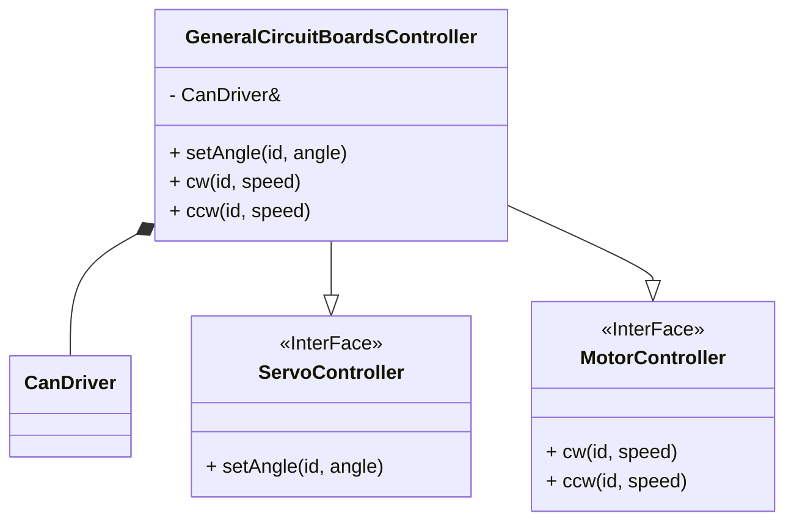
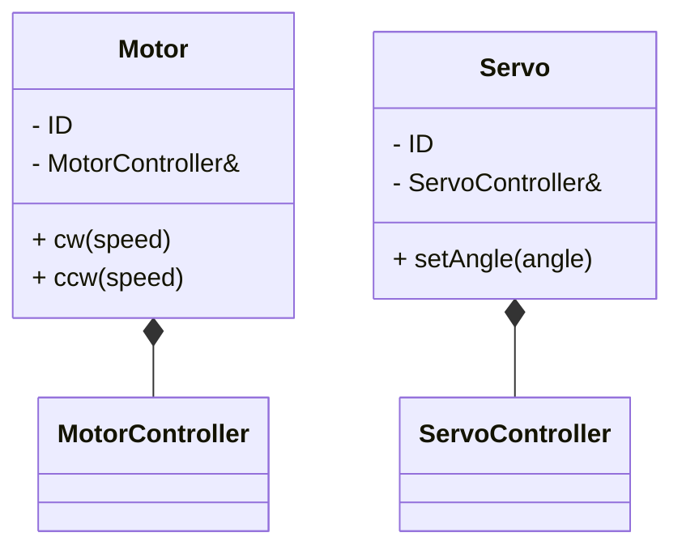

# クラス構成 説明

`esp-can`ライブラリ。CAN通信に使用。

汎用基板クラス。汎用基板との通信に`CanDriver`クラスの参照を持つ(集約)。

角度制御が可能であるため`ServoController`インターフェースを継承する。

速度制御が可能であるため`MotorController`インターフェースを継承する。

モータ/サーボをオブジェクトとして扱うためのクラス。それぞれコントローラの参照を持つ(集約)。

コントローラがインタフェースであるため継承によって拡張できる。
