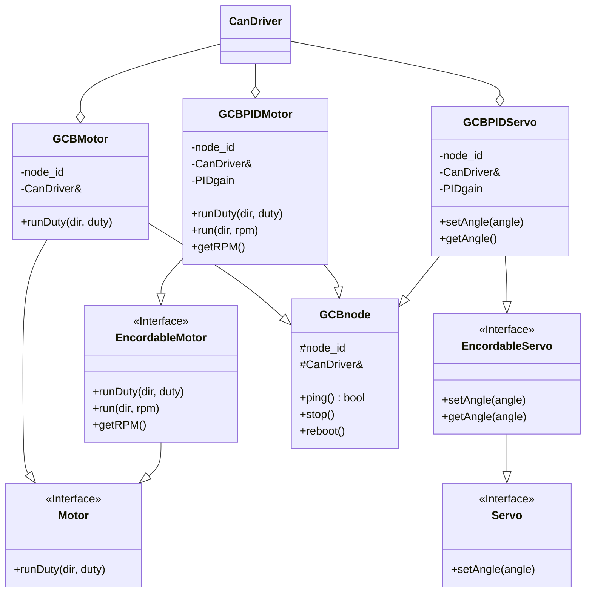

# クラス設計

## クラス図

```mermaid
classDiagram

class GCBMotor {
    +runDuty(dir, duty)
    -node_id
    -CanDriver&
}
class GCBPIDMotor {
    +runDuty(dir, duty)
    +run(dir, rpm)
    +getRPM()
    -node_id
    -CanDriver&
    -PIDgain
}
class GCBPIDServo {
    +setAngle(angle)
    +getAngle()
    -node_id
    -CanDriver&
    -PIDgain
}

class Motor {
    <<Interface>>
    +runDuty(dir, duty)
}
class EncordableMotor {
    <<Interface>>
    +runDuty(dir, duty)
    +run(dir, rpm)
    +getRPM()
}
class Servo {
    <<Interface>>
    +setAngle(angle)
}
class EncordableServo {
    <<Interface>>
    +setAngle(angle)
    +getAngle(angle)
}
class GCBnode {
    #node_id
    #CanDriver&
    +ping() bool
    +stop()
    +reboot()
}

GCBMotor --|> Motor
GCBMotor --|> GCBnode
GCBPIDMotor --|> EncordableMotor
GCBPIDMotor --|> GCBnode
GCBPIDServo --|> EncordableServo
GCBPIDServo --|> GCBnode
EncordableMotor --|> Motor
EncordableServo --|> Servo
CanDriver --o GCBMotor
CanDriver --o GCBPIDMotor
CanDriver --o GCBPIDServo
```
