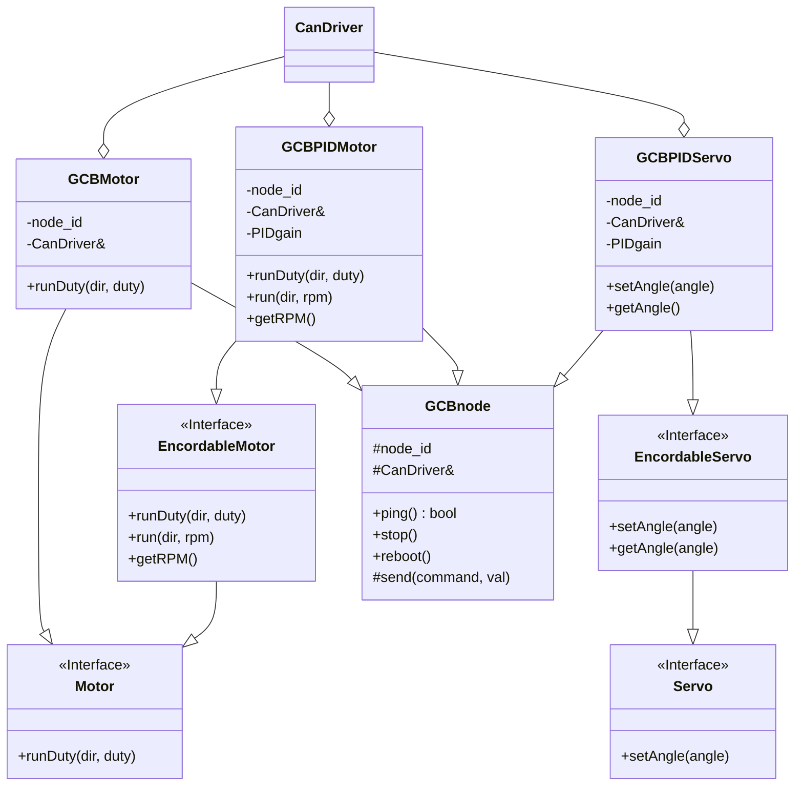

# クラス設計

## クラス図

## 説明

### 汎用基板モータクラス(GCBMotor)

#### GCBMotor-機能

汎用基板を使用しDCモータをdutyでフィードフォワード制御します。

#### GCBMotor-継承関係

DCモータをdutyで制御するのでMotorクラスを継承します。

汎用基板を使用するのでGCBnodeクラスを継承します。

#### GCBMotor-集約/コンポジット関係

汎用基板とのCAN通信のためCanDriverクラスの参照を持ちます。

### 汎用基板PID制御モータクラス(GCBPIDMotor)

#### GCBPIDMotor-機能

汎用基板を使用しDCモータをPIDで速度制御します。

#### GCBPIDMotor-継承関係

DCモータを速度制御しフィードバックを受け取るためEncordableMotorクラスを継承します。

汎用基板を使用するのでGCBnodeクラスを継承します。

#### GCBPIDMotor-集約/コンポジット関係

汎用基板とのCAN通信のためのCanDriverクラスの参照を持ちます。

PID制御のためのゲインを持ちます。

### 汎用基板PID制御サーボクラス(GCBPIDServo)

#### GCBPIDServo-機能

汎用基板を使用しDCモータをPIDで角度制御します。

#### GCBPIDServo-継承関係

DCモータを角度制御しフィードバックを受け取るためEncordableServoクラスを継承します。

汎用基板を使用するのでGCBnodeクラスを継承します。

#### GCBPIDServo-集約/コンポジット関係

汎用基板とのCAN通信のためのCanDriverクラスの参照を持ちます。

PID制御のためのゲインを持ちます。
