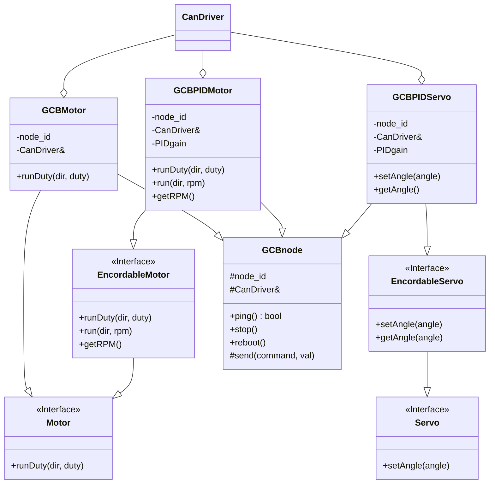

# クラス設計

## クラス図

## 説明

### 汎用基板モータクラス(GCBMotor)

#### GCBMotor-機能

汎用基板を使用しDCモータをdutyでフィードフォワード制御します。

#### GCBMotor-継承関係

DCモータをdutyで制御するのでMotorクラスを継承します。

汎用基板を使用するのでGCBnodeクラスを継承します。

#### GCBMotor-集約/コンポジット関係

汎用基板とのCAN通信のためCanDriverクラスの参照を持ちます。

### 汎用基板PID制御モータクラス(GCBPIDMotor)

#### GCBPIDMotor-機能

汎用基板を使用しDCモータをPIDで速度制御します。

#### GCBPIDMotor-継承関係

DCモータを速度制御しフィードバックを受け取るためEncordableMotorクラスを継承します。

汎用基板を使用するのでGCBnodeクラスを継承します。

#### GCBPIDMotor-集約/コンポジット関係

汎用基板とのCAN通信のためのCanDriverクラスの参照を持ちます。

PID制御のためのゲインを持ちます。

### 汎用基板PID制御サーボクラス(GCBPIDServo)

#### GCBPIDServo-機能

汎用基板を使用しDCモータをPIDで角度制御します。

#### GCBPIDServo-継承関係

DCモータを角度制御しフィードバックを受け取るためEncordableServoクラスを継承します。

汎用基板を使用するのでGCBnodeクラスを継承します。

#### GCBPIDServo-集約/コンポジット関係

汎用基板とのCAN通信のためのCanDriverクラスの参照を持ちます。

PID制御のためのゲインを持ちます。

### モータインタフェース(Motor)

#### Motor-含まれるクラス

Cytron, 汎用基板, ロボマスを問わずモータをdutyで制御できる=`runDuty(dir, duty)`メソッドを持つクラスがこれに含まれます。

### サーボインタフェース(Servo)

#### Servo-含まれるクラス

SG90, 汎用基板, ロボマスを問わずモータが角度で制御できる=`setAngle(angle)`メソッドを持つクラスがこれに含まれます。

### フィードバック付きモータインタフェース(EncordableMotor)

#### EncordableMotor-含まれるクラス

汎用基板や諸モータ+ロータリエンコーダなど、モータを速度で制御でき、かつフィードバックを受け取れる=`setRPM(dir, rpm)`及び`getRPM()`メソッドを持つクラスがこれに含まれます。

### フィードバック付きサーボインタフェース(EncordableServo)

#### EncordableServo-含まれるクラス

汎用基板や諸モータ+ロータリエンコーダなど、モータを角度で制御でき、かつフィードバックを受け取れる=`setAngle(angle)`及び`getAngle()`メソッドを持つクラスがこれに含まれます。

### 汎用基板論理ノードクラス(GCBnode)

#### GCBnode-含まれるクラス

汎用基板の一つの論理ノードに繋いで動くクラスを指します。

これは汎用基板に(モータ+ロータリエンコーダ), (モータ)をつないだ場合、括弧により囲んだそれぞれが汎用基板の論理ノードとして認識されます。基本的に汎用基板一枚につき論理ノードは1つ又は2つです。

汎用基板の機能として、`ping()`, `stop()`, `reboot()`などのメソッドと、ネットワーク中で論理ノードを区別するための`node_id`, 通信のための`CanDriver`の参照を持つクラスが当てはまります。
