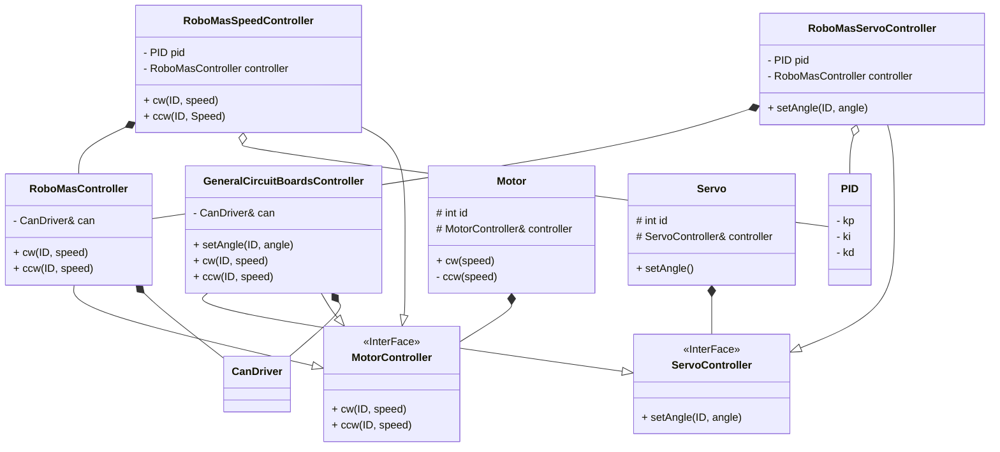

# クラス設計

```mermaid
classDiagram

class CanDriver{

}
class PID{
    - kp
    - ki
    - kd
}

GeneralCircuitBoardsController --|> ServoController
GeneralCircuitBoardsController --|> MotorController
GeneralCircuitBoardsController *-- CanDriver
class GeneralCircuitBoardsController {
    - CanDriver& can
    + setAngle(ID, angle)
    + cw(ID, speed)
    + ccw(ID, speed)
}
RoboMasController --|> MotorController
RoboMasController *-- CanDriver
class RoboMasController {
    - CanDriver& can
    + cw(ID, speed)
    + ccw(ID, speed)
}
RoboMasServoController *-- RoboMasController
RoboMasServoController o-- PID
RoboMasServoController --|> ServoController
class RoboMasServoController {
    - PID pid
    - RoboMasController controller
    + setAngle(ID, angle)
}
RoboMasSpeedController *-- RoboMasController
RoboMasSpeedController o-- PID
RoboMasSpeedController --|> MotorController
class RoboMasSpeedController{
    - PID pid
    - RoboMasController controller
    + cw(ID, speed)
    + ccw(ID, Speed)
}

class ServoController {
    <<InterFace>>
    + setAngle(ID, angle)
}
class MotorController {
    <<InterFace>>
    + cw(ID, speed)
    + ccw(ID, speed)
}

Motor *-- MotorController
class Motor{
    # int id
    # MotorController& controller
    + cw(speed)
    - ccw(speed)
}
Servo *-- ServoController
class Servo{
    # int id
    # ServoController& controller
    + setAngle()
}
```
