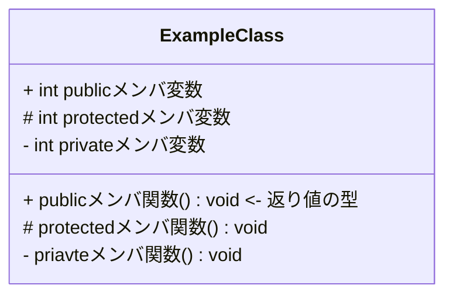
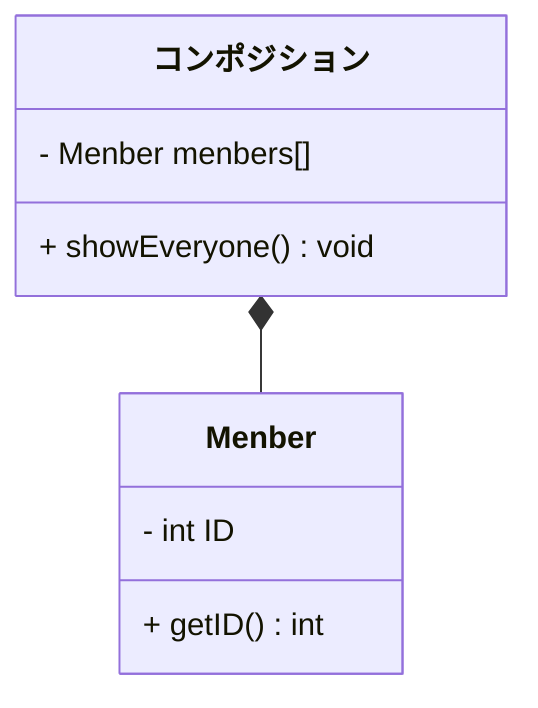
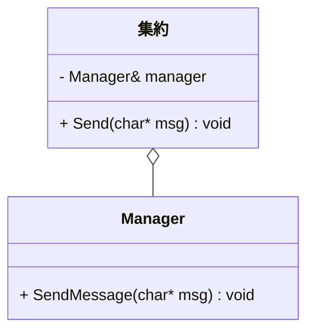

# クラス設計

## 前提知識 - クラス図の見方







```mermaid
classDiagram

class Animal {
    <<Interface>>
    + run() void
    + sleep() void
}
class Dog {
    + run() void
    + sleep() void
}
Animal <|-- Dog : 継承
